  EN &nbsp; / &nbsp; <a href="README.zh-CN.md">简体中文 ↗</a>

<h2 align="center">Hi there, I'm kyrie</h2>

  

  

  <strong>Graduate Student in Control Engineering</strong> 
  University of Electronic Science and Technology of China (UESTC) 
  Cooperative control of underwater robots

---

## 

  

## 

  

## 

  

[Eventt11.m ↗](https://github.com/KRIE2324/Matlab-Learning/blob/main/Eventt11.m)

## 

  

---

kyrie &nbsp; · &nbsp; <a href="https://github.com/KRIE2324?tab=repositories">All repositories ↗</a>

