  <a href="https://github.com/KRIE2324">English ↗</a> &nbsp; / &nbsp; 中文

<h2 align="center">你好，我是 kyrie</h2>

  

  

  <strong>电子科技大学 · 控制工程研究生</strong> 
  专注于水下机器人协同控制

---

## 

  

## 

  

## 

  

[Eventt11.m ↗](https://github.com/KRIE2324/Matlab-Learning/blob/main/Eventt11.m)

## 

  

---

kyrie &nbsp; · &nbsp; <a href="https://github.com/KRIE2324?tab=repositories">全部仓库 ↗</a>

