  <a href="https://github.com/KRIE2324">English ↗</a> &nbsp; / &nbsp; 中文

<h2 align="center">你好，我是 kyrie</h2>

  

  

  <strong>电子科技大学 · 控制工程研究生</strong> 
  专注于水下机器人协同控制

---

### 关于我

你好，我是 **kyrie**，目前在**电子科技大学**攻读控制工程研究生，研究方向为**水下机器人协同控制**。

我在这里分享 MATLAB 学习与仿真代码，也欢迎围绕控制工程、水下机器人和协同控制交流想法。

### 研究方向

| 领域 | 关注方向 |
| :--- | :--- |
| 控制工程 | 控制方法与系统仿真 |
| 水下机器人 | 多机器人协同控制 |

### 项目

**[Matlab-Learning](https://github.com/KRIE2324/Matlab-Learning)**

MATLAB 学习与仿真代码仓库，包含 [Eventt11.m](https://github.com/KRIE2324/Matlab-Learning/blob/main/Eventt11.m) 等脚本。

[浏览代码 →](https://github.com/KRIE2324/Matlab-Learning)

### 联系我

欢迎交流研究问题、仿真实现与合作想法。

**Email:** [kyrielrving123789@gmail.com](mailto:kyrielrving123789@gmail.com)

---

kyrie &nbsp; · &nbsp; <a href="https://github.com/KRIE2324?tab=repositories">全部仓库 ↗</a>

